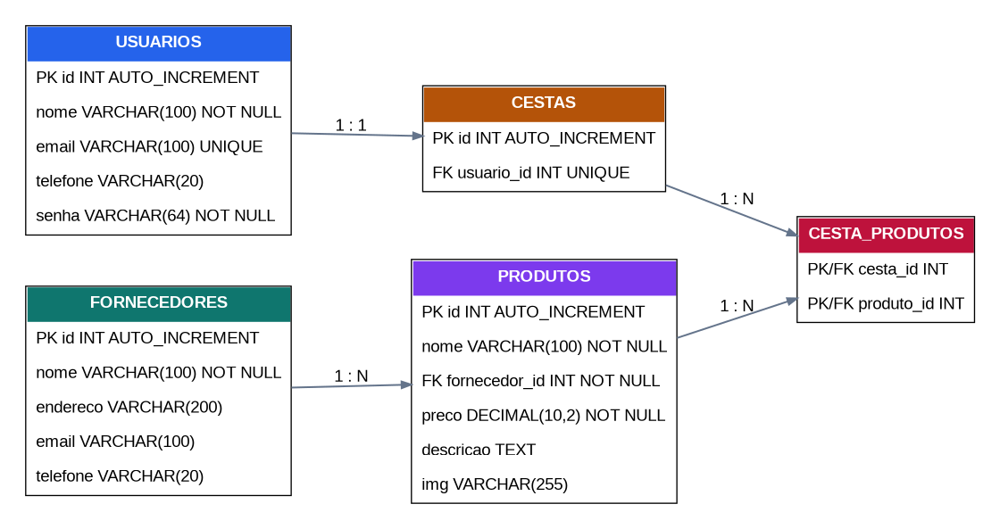

# GestProd — Mini Sistema de Gestão de Produtos

## Descrição

O GestProd é um mini sistema de gestão de produtos desenvolvido para a disciplina, utilizando PHP no backend, MySQL com PDO, HTML, CSS, JavaScript e Bootstrap. O sistema permite autenticação de usuários, cadastro de fornecedores e produtos, seleção de produtos e montagem de uma cesta com resumo de quantidade e valor total.

## Integrantes

- Nome: **Maria Eduarda Ferreira Magalhães** — RA:  **60007031**
- Nome: **Pedro Augusto Bazana Françolin** — RA:  **60010321**

## Tecnologias

- PHP 8+
- MySQL
- PDO
- HTML5 e CSS3
- JavaScript (Fetch/AJAX)
- Bootstrap 5 via CDN
- Git e GitHub

## Funcionalidades

- Cadastro e autenticação de usuários.
- Armazenamento da senha com hash SHA-256, conforme o enunciado da atividade.
- Cadastro e listagem de fornecedores.
- Cadastro e listagem de produtos vinculados a fornecedores.
- Seleção de produtos por checkbox, considerando uma unidade de cada produto.
- Cesta individual por usuário, com remoção de produtos.
- Resumo da cesta com quantidade de produtos e valor total.
- Área de atualização automática com AJAX para usuários, fornecedores e produtos.
- Criação automática do banco e das tabelas na primeira execução.

## Como executar no XAMPP

1. Instale e abra o XAMPP.
2. Inicie os módulos **Apache** e **MySQL**.
3. Copie a pasta `gestao-produtos` para `C:/xampp/htdocs/`.
4. Confira as credenciais em `config/database.php`:
   - Host: `localhost`
   - Usuário: `root`
   - Senha: vazia, se essa for a configuração do seu XAMPP
5. Acesse no navegador:

   `http://localhost/gestao-produtos/public/cadastro.php`

6. Crie uma conta e depois faça login.
7. Cadastre primeiro um fornecedor e depois um produto.
8. Acesse **Selecionar** para montar a cesta.
9. Acesse **AJAX** para conferir a atualização automática dos três elementos.

## Estrutura do banco

O banco é criado automaticamente pelo arquivo `config/database.php`. Também existe uma versão SQL em `database/schema.sql`.

### Relacionamentos

- `fornecedores` 1:N `produtos`.
- `usuarios` 1:1 `cestas` na implementação atual.
- `cestas` N:N `produtos`, resolvido por `cesta_produtos`.

## DER — Etapa 2



Arquivo editável em DBML: [`database/schema.dbml`](./database/schema.dbml)

## Wireframes — Etapa 1

Os wireframes usados na análise estão disponíveis na pasta `docs`. Eles apresentam a navegação, cadastro de fornecedores, cadastro de produtos, catálogo, gerenciamento, cesta e pedido finalizado.

- [Tela inicial](./docs/wireframe-inicio.png)
- [Cadastro de fornecedor](./docs/wireframe-cadastro-fornecedor.png)
- [Cadastro de produto](./docs/wireframe-cadastro-produto.png)
- [Catálogo](./docs/wireframe-catalogo.png)
- [Gerenciamento de fornecedores](./docs/wireframe-gerenciar-fornecedores.png)
- [Gerenciamento de produtos](./docs/wireframe-gerenciar-produtos.png)
- [Cesta](./docs/wireframe-carrinho.png)
- [Cestas vazias](./docs/wireframe-cestas.png)
- [Pedido finalizado](./docs/wireframe-pedido-finalizado.png)

**Link do Figma: https://www.figma.com/make/F4KOSngArZtIhNAmDEL00I/Sistema-de-Gest%C3%A3o-de-Produtos?t=JnEmjIhrgPf3d6yJ-1** 

## Organização do projeto

```text
gestao-produtos/
├── classes/
├── config/
├── database/
├── docs/
├── includes/
├── public/
│   ├── ajax/
│   ├── css/
│   └── js/
├── modelagem.txt
└── README.md
``` 
